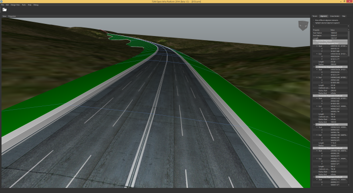

TUM Open Infra Platform
========================

`TUM Open Infra Platform`is a software for viewing alignment data. Currently it supports displaying alignment models of LandXML and our IFC based Alignment proposal (short IfcAlignment - More details). Furthermore it supports the conversion of LandXML files to IfcAlignment Step files and vice versa.

